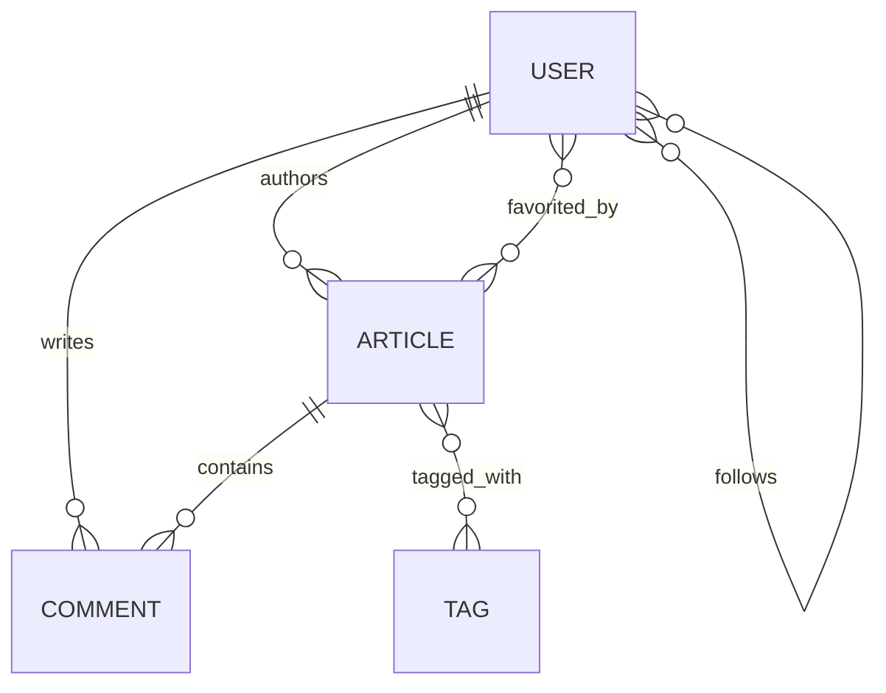

# Architecture — Kotlin Spring RealWorld API

> Repository snapshot: `kotlin-spring-realworld-example-app`, branch `master`, HEAD `848c29e`.
>
> This document describes the architecture that is actually present in the repository. It is not a proposal for a clean-architecture rewrite. Current deviations and extension constraints are called out explicitly so that future changes do not accidentally rely on assumptions that the codebase does not satisfy.

## 1. System summary

The project is a single-module Kotlin application that implements the backend portion of the [RealWorld](https://github.com/gothinkster/realworld) API.

| Concern | Current implementation |
| --- | --- |
| Build | Maven, `pom.xml`, Maven wrapper |
| Runtime | Spring Boot `3.0.6`, embedded servlet container |
| Language | Kotlin `1.8.21` on Java `17` |
| HTTP stack | Spring MVC (`spring-boot-starter-web`), synchronous request handling |
| Persistence | Spring Data JPA/Hibernate with blocking repositories |
| Local database | H2 in-memory database in `src/main/resources/application.properties` |
| Authentication | Custom JWT validation implemented with Spring AOP and a request-thread `ThreadLocal` |
| Serialization | Jackson Kotlin module, root unwrapping for request bodies, explicit response wrappers |
| Runtime integrations | None; Feign interfaces are test clients, not application adapters |
| Tests | JUnit 4-style Spring Boot integration tests using Feign and a random HTTP port |

The POM description says “Spring Boot Reactive”, but the actual dependency and configuration set is servlet-based: it uses `spring-boot-starter-web`, `WebMvcConfigurer`, `HttpServletRequest`, `HttpServletResponse`, and JPA. The application must therefore be treated as a blocking MVC service, not as WebFlux or a reactive data service.

## 2. Runtime topology

The application is packaged as one executable JAR. There is no Dockerfile, deployment manifest, CI workflow, schema-migration directory, or external service configuration in the repository. The documented local startup path is `mvn spring-boot:run`.

```text
HTTP client
    |
    v
Embedded Spring Boot servlet application
    |
    +--> Spring MVC dispatching
    |       |
    |       +--> ExposeResponseInterceptor
    |       +--> ApiKeySecuredAspect (only for annotated handler methods)
    |       +--> web/*Handler
    |
    +--> UserService (authentication/token state)
    |
    +--> repository/* --> Spring Data JPA/Hibernate --> H2 in-memory database
    |
    +--> model/inout/* --> Jackson response/request representation
```

The Feign interfaces under `io.realworld.client` are used by `ApiApplicationTests` to call the running application. They are not injected into production beans and do not represent an outbound integration boundary in the current runtime.

## 3. Package and responsibility map

The package layout is a pragmatic layered arrangement:

| Package | Responsibility | Representative symbols |
| --- | --- | --- |
| `io.realworld` | Application bootstrap and MVC-wide configuration | `ApiApplication` |
| `io.realworld.web` | REST endpoints, request validation orchestration, response envelopes, authorization annotations on endpoints | `UserHandler`, `ProfileHandler`, `ArticleHandler`, `TagHandler`, `InvalidRequestHandler` |
| `io.realworld.service` | Shared application logic for users, password verification, JWT creation/validation, and request-local current-user state | `UserService` |
| `io.realworld.repository` | Spring Data repository contracts and article query specifications | `UserRepository`, `ArticleRepository`, `CommentRepository`, `TagRepository` |
| `io.realworld.repository.specification` | Dynamic JPA predicates for article filtering | `ArticlesSpecifications.lastArticles` |
| `io.realworld.model` | JPA entities and persistence relationships | `User`, `Article`, `Comment`, `Tag` |
| `io.realworld.model.inout` | HTTP input/output models and entity-to-response mapping | `Register`, `Login`, `Article`, `Profile`, `Comment` |
| `io.realworld.jwt` | Custom authorization annotation, AOP enforcement, and response exposure workaround | `ApiKeySecured`, `ApiKeySecuredAspect`, `ExposeResponseInterceptor` |
| `io.realworld.exception` | Domain/application exceptions and validation trigger | `InvalidRequest`, `InvalidException`, `NotFoundException` |
| `io.realworld.client` | Declarative Feign contracts used by integration tests | `UserClient`, `ProfileClient`, `TagClient` |

The handlers are named `*Handler`, but are Spring `@RestController` classes. They currently combine HTTP concerns with direct repository access and a substantial amount of business workflow logic. `UserService` is the only general-purpose service class in the repository.

## 4. Request lifecycle

A normal API request follows this sequence:

1. `ApiApplication` registers `ExposeResponseInterceptor` and a permissive CORS mapping for `/api/**`.
2. The interceptor stores the current `HttpServletResponse` in a request attribute. This is needed because `ApiKeySecuredAspect` autowires the request but not the response.
3. Spring MVC selects a handler method.
4. If the method has `@ApiKeySecured`, `ApiKeySecuredAspect` runs around it:
   - `OPTIONS` requests proceed without authentication;
   - the `Authorization` header is read and the literal `Token ` prefix is removed;
   - the token is looked up in `UserRepository` through `UserService.findByToken`;
   - the JWT signature, subject, issuer, and expiration are validated;
   - the resolved user is stored in `UserService.currentUser`, a `ThreadLocal<User>`;
   - optional endpoints receive an empty `User()` sentinel when no valid user is supplied;
   - mandatory failures are written directly as a 401 response and the handler is not called.
5. The handler validates request errors, loads or mutates entities through repositories, and maps the result to an output model when one exists.
6. Jackson serializes the returned map into the RealWorld-style response envelope.
7. On the successful aspect path, the current-user `ThreadLocal` is cleared after the handler returns.

The interceptor is registered without a path pattern, while CORS is configured only for `/api/**`. The interceptor therefore participates in requests outside the API prefix as well, even though the application currently exposes no other controller routes.

## 5. Authentication and authorization architecture

Authentication is stateful from the application’s point of view, even though the credential format is JWT:

```text
register/login
    -> bcrypt password check or hash
    -> create JWT
    -> persist JWT in users.token

secured request
    -> Authorization: Token <jwt>
    -> find user by persisted token
    -> parse and validate JWT with jwt.secret/jwt.issuer
    -> put User in ThreadLocal
    -> invoke annotated handler
```

### Endpoint modes

`@ApiKeySecured(mandatory = true)` is the default for authenticated operations. `mandatory = false` allows anonymous access while still making the current user available to response mapping when a valid token is present.

| Mode | Current endpoints |
| --- | --- |
| Public, no aspect | `GET /api/tags`, `POST /api/users`, `POST /api/users/login` |
| Optional authentication | Article listing/detail/comments, profile lookup |
| Required authentication | Current-user operations, feed, article creation/update/deletion, comments mutation, follow/unfollow, favorite/unfavorite |

The contract is `Authorization: Token <jwt>`, not the more common `Bearer <jwt>`. The persisted token lookup means token rotation updates the user row and invalidates the previous stored token. `UserService.login` updates a token, and `UserHandler.login` invokes another token update before returning, so login currently contains two token-update operations.

Authorization is primarily ownership-based in handler code. For example, article update/delete checks `article.author.id`, comment deletion checks both article identity and comment author identity, and follow/favorite operations mutate the current user or article collections.

### Security boundary limitations

The current design has several important architectural properties that must not be hidden by the JWT label:

- JWT secrets and issuer are read from plain properties; the repository contains a concrete secret value.
- The token is logged in an informational message when lookup fails.
- `ThreadLocal` cleanup is performed after successful `proceed()` but not in a `finally` block around all exit paths.
- Unauthorized responses are written by the aspect rather than returned through the normal exception/advice pipeline.
- CORS allows every origin, method, and header for `/api/**` (with credentials disabled).
- There is no Spring Security filter chain or resource-server configuration.

These are current implementation facts, not recommendations. The maintenance rules for changing this boundary are in `04-engineering-standards.md`.

## 6. Domain model and persistence relationships

The persistence model consists of four JPA entities:



| Entity | Key fields | Relationships |
| --- | --- | --- |
| `User` | `email`, `username`, bcrypt `password`, persisted `token`, `bio`, `image`, generated `id` | Self-referencing `@ManyToMany follows` |
| `Article` | `slug`, `title`, `description`, `body`, `createdAt`, `updatedAt`, generated `id` | `@ManyToOne author`, `@ManyToMany tagList`, `@ManyToMany favorited` |
| `Comment` | `createdAt`, `updatedAt`, `body`, generated `id` | `@ManyToOne article`, `@ManyToOne author` |
| `Tag` | `name`, generated `id` | Referenced by articles through `tagList` |

Join tables, fetch modes, cascade behavior, ownership, uniqueness constraints, and indexes are left to JPA defaults. There are no explicit migrations or database DDL files. Entity classes are Kotlin `data class` declarations with mutable relationship collections; this is a significant persistence constraint because generated equality/hash-code includes mutable fields unless deliberately controlled.

HTTP output does not generally serialize article and comment entities directly. `io.realworld.model.inout.Article`, `Comment`, and `Profile` convert entities into API-safe representations and calculate `following`, `favorited`, and `favoritesCount` relative to the current user. `User` is returned directly inside the user response envelope, with `password` and `follows` ignored by Jackson; its `token` remains part of the serialized user object.

## 7. Repository and query architecture

Repositories are Spring Data interfaces:

- `UserRepository : CrudRepository<User, Long>` provides uniqueness checks and lookup by email, username, and persisted token.
- `ArticleRepository` combines `CrudRepository`, `PagingAndSortingRepository`, and `JpaSpecificationExecutor` for CRUD, paging, and dynamic filters.
- `CommentRepository` provides article-based and created-at-descending lookups.
- `TagRepository` provides CRUD and name lookup.

`ArticlesSpecifications.lastArticles` composes optional predicates for tag membership, author, and favorited-by-user. Article feeds use `findByAuthorIdInOrderByCreatedAtDesc` with the IDs of users followed by the current user.

The API exposes `limit` and `offset`, but the handlers pass `offset` directly to `PageRequest.of(offset, limit)`. Spring Data interprets that value as a zero-based page number, not as an item offset. `articlesCount` is the size of the returned page, not a repository-wide total. Both behaviors are part of the current implementation and should be treated as compatibility-sensitive when corrected.

Multi-step writes are performed directly in handlers. The code does not declare explicit `@Transactional` boundaries. Article deletion manually deletes associated comments first, and tag creation is performed lazily while creating or updating an article.

## 8. HTTP API surface

All application routes use the `/api` prefix and return JSON maps whose keys form the outer response envelope.

| Method | Route | Authentication | Envelope / result |
| --- | --- | --- | --- |
| `POST` | `/api/users/login` | Public | `{ "user": ... }` |
| `POST` | `/api/users` | Public | `{ "user": ... }` |
| `GET` | `/api/user` | Required | `{ "user": ... }` |
| `PUT` | `/api/user` | Required | `{ "user": ... }` |
| `GET` | `/api/profiles/{username}` | Optional | `{ "profile": ... }` |
| `POST` | `/api/profiles/{username}/follow` | Required | `{ "profile": ... }` |
| `DELETE` | `/api/profiles/{username}/follow` | Required | `{ "profile": ... }` |
| `GET` | `/api/tags` | Public | `{ "tags": [...] }` |
| `GET` | `/api/articles` | Optional | `{ "articles": [...], "articlesCount": n }` |
| `GET` | `/api/articles/feed` | Required | `{ "articles": [...], "articlesCount": n }` |
| `GET` | `/api/articles/{slug}` | Optional | `{ "article": ... }` |
| `POST` | `/api/articles` | Required | `{ "article": ... }` |
| `PUT` | `/api/articles/{slug}` | Required | `{ "article": ... }` |
| `DELETE` | `/api/articles/{slug}` | Required | Empty 200 response |
| `GET` | `/api/articles/{slug}/comments` | Optional | `{ "comments": [...] }` |
| `POST` | `/api/articles/{slug}/comments` | Required | `{ "comment": ... }` |
| `DELETE` | `/api/articles/{slug}/comments/{id}` | Required | Empty 200 response |
| `POST` | `/api/articles/{slug}/favorite` | Required | `{ "article": ... }` |
| `DELETE` | `/api/articles/{slug}/favorite` | Required | `{ "article": ... }` |

Request bodies use root names such as `user`, `article`, and `comment` because `spring.jackson.deserialization.UNWRAP_ROOT_VALUE=true` is enabled and the input classes carry `@JsonRootName`. Validation failures are represented as:

```json
{
  "errors": {
    "field": ["message"]
  }
}
```

`InvalidRequestHandler` returns that shape with HTTP 422 for `InvalidException`. `NotFoundException`, `ForbiddenRequestException`, and `UnauthorizedException` use `@ResponseStatus` for 404, 403, and 401 respectively. The AOP authorization failure writes its own 401 JSON response directly.

Output dates are converted from `OffsetDateTime` to ISO zoned date-time strings normalized to UTC (`ZoneId.of("Z")`) by the in/out mappers.

## 9. Configuration and application-wide beans

`ApiApplication` enables and configures:

- `@SpringBootApplication` component scanning from `io.realworld`;
- `@EnableCaching`, although no cache annotation is used in the current source;
- `ExposeResponseInterceptor`;
- permissive CORS for `/api/**`;
- `MethodValidationPostProcessor` with a `LocalValidatorFactoryBean`.

`application.properties` currently defines:

- H2 in-memory JDBC URL, Oracle compatibility mode, and H2 dialect;
- empty H2 password and `sa` user;
- Jackson root-value unwrapping;
- `jwt.secret` and `jwt.issuer` as literal properties.

There are no profile-specific property files, environment-variable placeholders, typed `@ConfigurationProperties`, external secret provider, or production database settings in the repository.

## 10. Test architecture

`ApiApplicationTests` starts the complete Spring Boot context on a random port. Before each test it builds Feign clients manually with `GsonEncoder` and `GsonDecoder`, then exercises real HTTP endpoints.

The current integration coverage verifies:

- tag retrieval can be invoked;
- registration and login return the expected username, email, and non-null token;
- profile lookup, follow, and unfollow update the observed `following` flag.

There are no dedicated unit tests, repository tests, MVC slice tests, authorization failure tests, serialization contract tests, article/comment workflow tests, migration tests, or production-database tests. H2 is the only configured database, so behavior that depends on another database dialect is not covered.

## 11. Architectural constraints for future changes

When extending the current system:

1. Keep HTTP concerns in `web` and keep response envelopes compatible with the RealWorld contract.
2. Keep persistence entities in `model` and use `model.inout` types for new public request/response contracts instead of exposing new entity fields.
3. Put workflows that span multiple repositories, authorization decisions, or writes into a service rather than increasing handler complexity.
4. Add repository-specific queries/specifications under `repository`; do not embed ad-hoc database logic in DTO mappers.
5. Mark authentication requirements explicitly with `@ApiKeySecured` until the authentication boundary is intentionally replaced.
6. Treat `Authorization: Token <jwt>`, wrapper names, date format, status codes, and pagination behavior as public compatibility surfaces.
7. Treat any persistence relationship or schema change as a database change even though the local database is H2; the current repository has no migration mechanism.
8. Preserve the blocking MVC/JPA execution model unless a complete module-level migration to WebFlux/reactive persistence is deliberately designed and tested.

The detailed implementation rules, review checklist, and prioritized deviations are defined in `04-engineering-standards.md`.
